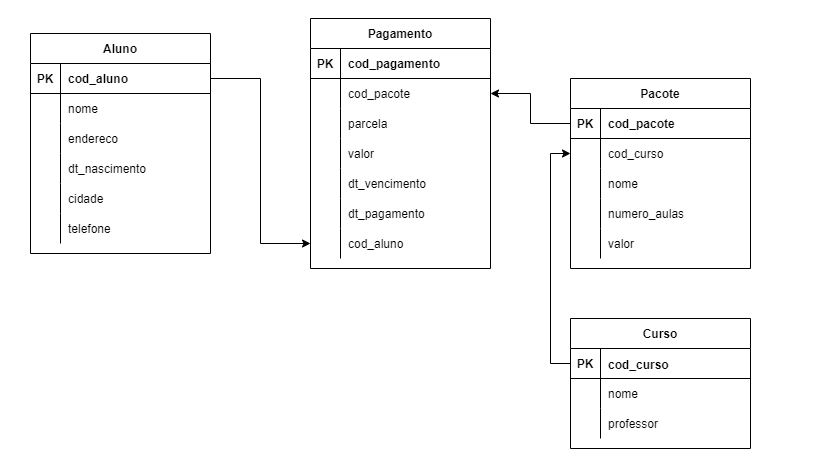
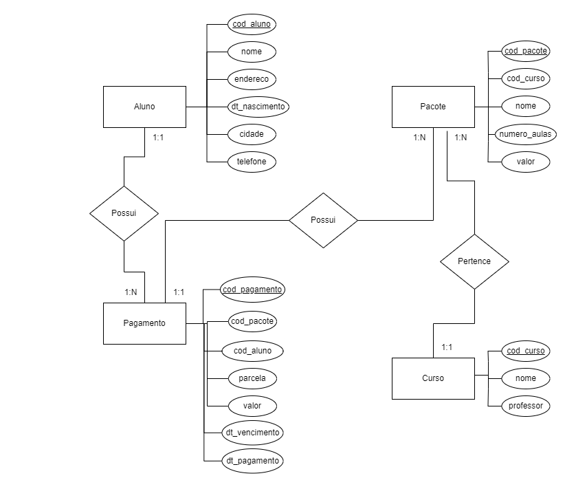

# Modelagem de um Banco de dados relacional

## Análise de Requisitos

### Escola de Música

#### A escola Saber Ouvir é uma pequena escola de música e possui apenas dois cursos, um para cada instrumento (violão e piano). Cada curso possui apenas um professor.

#### O aluno é cadastrado com os seguintes dados pessoais: nome, data de nascimento, telefone, endereço e cidade

#### A escola possui pacotes de aulas predefinidos, e em cada um deles é informado o curso, a opção de 10, 15 ou 20 aulas e o valor do pacote. O aluno escolhe qual pacote de aulas vai comprar e quando compra um pacote, este pode ser parcelado em até quatro vezes.

#### O aluno tem acesso a um portal financeiro, por meio do qual é possível saber qual foi o pacote adquirido, a parcela, o valor, a data de vencimento e a data de pagamento.

<hr>

## Modelo lógico



<hr>

## Modelo relacional



<hr>

## Modelagem física | SGBD MySql

```
CREATE TABLE Aluno
(
cod_aluno INT NOT NULL AUTO_INCREMENT,
nome VARCHAR(45) NOT NULL,
dt_nascimento DATE NOT NULL,
cidade VARCHAR(45) NOT NULL,
telefone VARCHAR(15) NOT NULL,
endereco VARCHAR(60) NOT NULL,
PRIMARY KEY(cod_aluno)
);
```

```
CREATE TABLE Curso
(
cod_curso INT NOT NULL AUTO_INCREMENT,
nome VARCHAR(45) NOT NULL,
professor VARCHAR(45) NOT NULL,
PRIMARY KEY(cod_curso)
);
```

```
CREATE TABLE Pacote
(
cod_pacote INT NOT NULL AUTO_INCREMENT,
cod_curso INT NOT NULL,
nome VARCHAR(45) NOT NULL,
numero_aulas INT NOT NULL,
valor DECIMAL NOT NULL,
PRIMARY KEY(cod_pacote),
FOREIGN KEY(cod_curso) REFERENCES Curso(cod_curso)
);
```

```
CREATE TABLE Pagamento
(
cod_pagamento INT NOT NULL AUTO_INCREMENT,
cod_pacote INT NOT NULL,
nome VARCHAR(45) NOT NULL,
numero_aulas INT NOT NULL,
valor DECIMAL NOT NULL,
dt_vencimento DATE NOT NULL,
dt_pagamento DATE NOT NULL,
PRIMARY KEY(cod_pagamento),
FOREIGN KEY(cod_pacote) REFERENCES Pacote(cod_pacote)
);
```